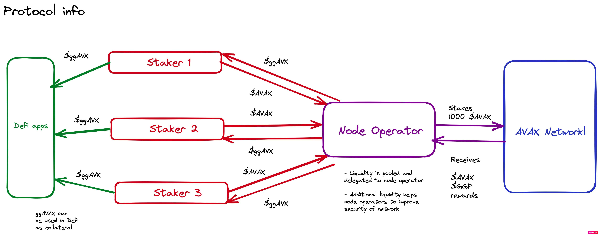
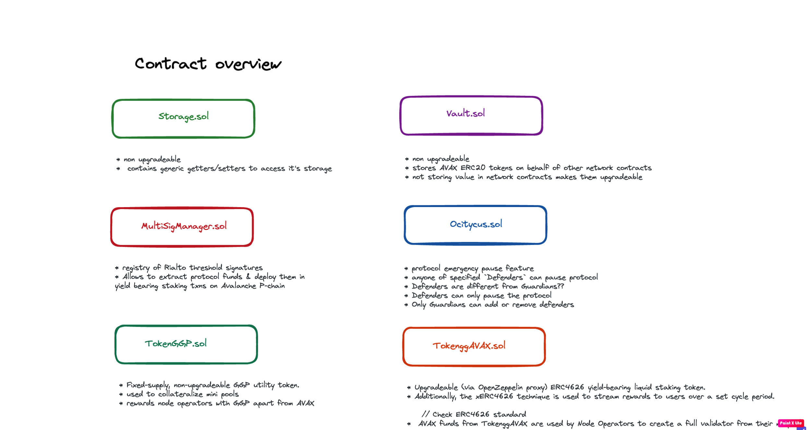
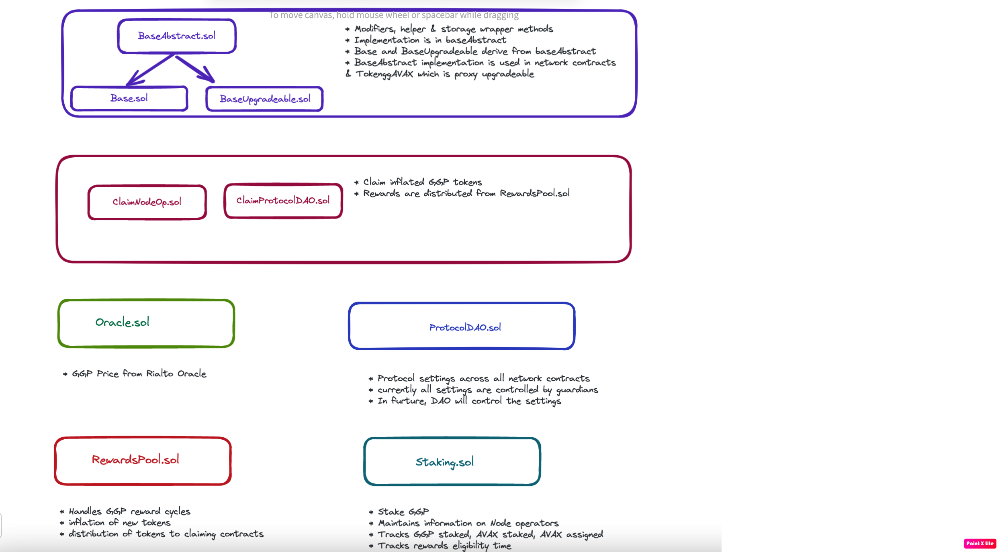
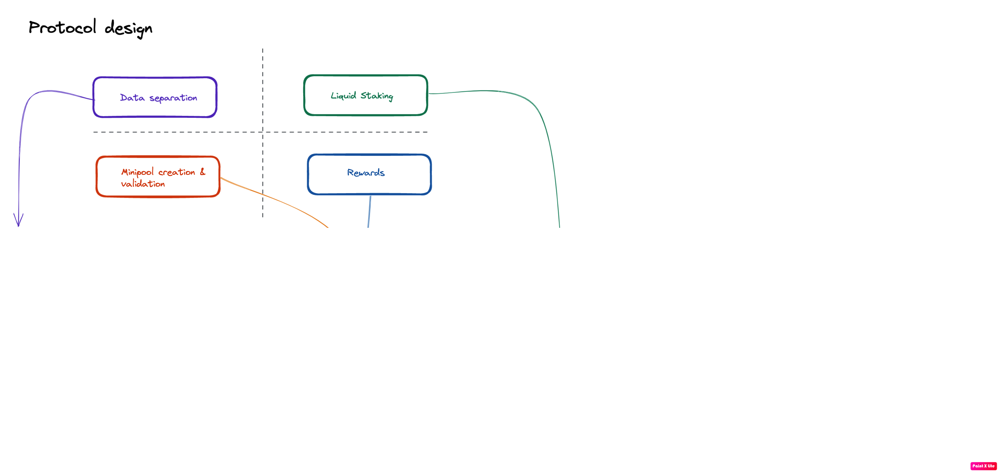
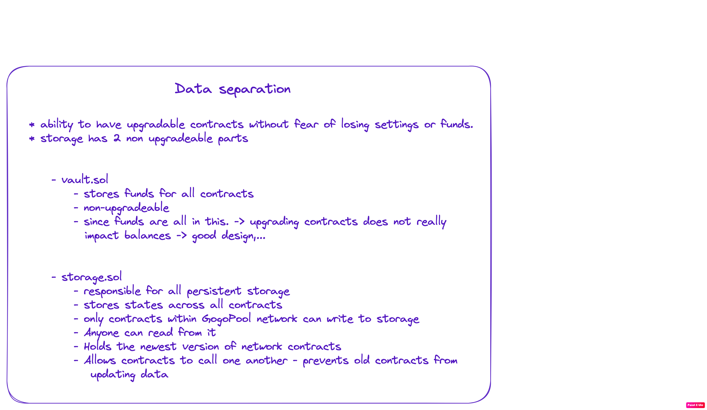
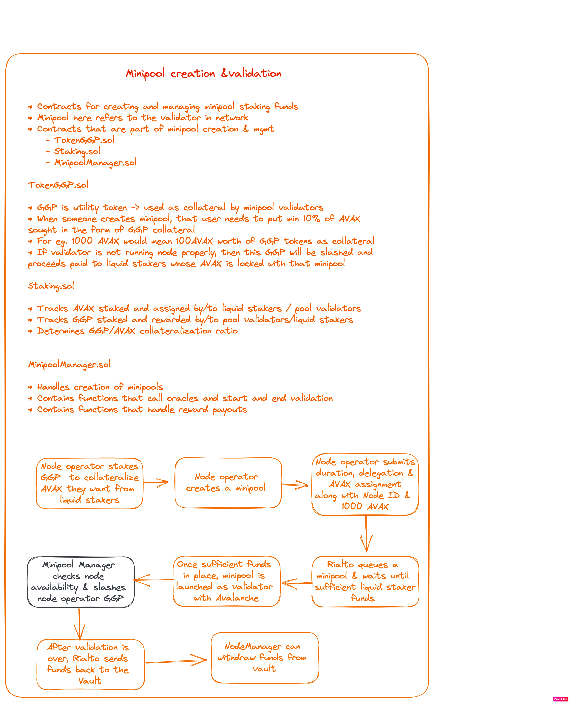
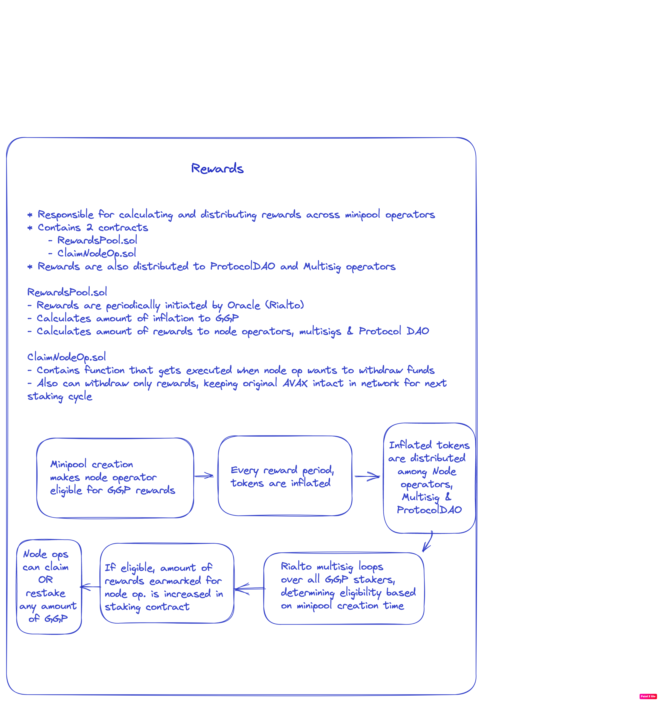

- liquid staking - users deposit AVAX and receive liquid staking token
- liquid staking token represents deposited AVAX and share of rewards acrrued over time
- users can deposit liquid staking token as collareal (basically adding leverage to system)

## How does it work?

- GoGoPool has two users; node operators and liquid stakers.

- Here is logic flow

  

**Node Operators**

- node operators can launch new validator nodes with only 1000 AVAX by being matched with liquid staking funds -> earn AVAX and GGP rewards
- By restaking GGP rewards node operators request delegation from the liquid staking pool, increasing their overall yield.
- stake a minimum of 1000 AVAX + 100 AVAX (in GGP tokens)

- Operators maintain their server infrastructure, and are matched with the other 1000 AVAX from a deposit pool of stakers. _operators are matched with a 1000 avax pool of stakers_

**Liquid Stakers**

- Liquid stakers deposit AVAX and receive ggAVAX
- ggAVAX represents the deposited AVAX and any rewards accrued, and can be used across DeFi apps to generate even more yield.
- wrapped proxy asset can then be freely transferred between addresses, traded on DEXs, and deposited within DeFi protocols.
- Min avax staked -.01
- to be a validator node - 1000 AVAX (unlike a P-chain validator - 2000 AVAX)
- Subnets are a group of validators nodes that come to consensus on something
- The deposited AVAX is automatically matched to node operators for staking.
- `ggAVAX` token accrues value over time based on the performance of the protocol.
- unlike `AVAX`, `ggAVAX` increases in value over time based on the performance of the pool

_Why_

- subnets are expensive to start, grow and manage.
- Every validator of a Subnet must also validate the Avalanche Primary Network (which requires paying 2000 AVAX as a minimum staking amount, and managing your own hardware).
- for devs experimenting on subnets - cost becomes very expensive..
- to run 5 nodes -> we are looking at 10000 AVAX - hardware setup is also an issue

- 3 goals

  - liquid staking
  - decentralized hardware operators
  - Subnet compatibility.

_Key info_

- GoGoPool uses a mix of smart contracts and DAOs to achieve this level of decentralization, despite technical challenges that prevent a pure trustless solution.

- `ggAVAX` is a synthetic derivative on `AVAX`
- represents stakers AVAX and also rewards accrued over time
- Users will be able to exchange ggAVAX back for AVAX (burns ggAVAX)
- `GGP` is ERC20 and serves as the protocol token for GoGoPool.
- Node Operators have to stake a minimum amount of GGP tokens to secure their assigned staking funds as insurance of good behavior.

- The minimum, at genesis, will be 10% of their staked amount, but the operator can choose as much as 150%.
- The higher the insurance, the higher their GGP rewards will be
- Node Operators may restake their monthly GGP rewards to request AVAX delegation from liquid stakers, increasing their overall AVAX + GGP yield.

- **if a node operator has excessively low uptime, stakers are compensated from the GGP insurance put up by the Node Operator.**

- This socializes the risk of being matched with a bad operator, and minimizes any potential losses.
- Slashed GGP can be sold to token holders at a discounted rate, with AVAX proceeds awarded to Liquid Stakers.

- Validators of each Subnet must also be a validator for the default Subnet, which is the main Avalanche network.

- Validators can participate in any arbitrary number of Subnets.

-

_About DAOs_

- 2 onchain DAOs - `RialtoDAO` and `ProtocolDAO`

`ProtocolDAO`

- Because of the open community orientation of this protocol, no platform fees will be charged.
- Instead, all rewards will be distributed to members of the ProtocolDAO, and losses due to bad behavior socialized amongst members.
- This way all members are guaranteed the maximum possible rewards.

`RialtoDAO`

- The RialtoDAO is initially made up of the core developer team, and will be decentralized over time.
- `RialtoDAO` does following

  - moving collected funds from C Chain to the P Chain - `cross chain staking`
  - moving rewards from P Chain to C Chain - `cross chain rewards`
  - f no node operators are present and the amount of unstaked AVAX in the deposit pool is over a decided upon threshold, `RialtoDAO` members can create their own pools using own hardware
  - Serve as an initial oracle to smart contracts.
  - To join the RialtoDAO, members must stake a sizable sum of GGP tokens?? -q how much??

  - If the majority of members vote that a member of the DAO is not fulfilling their duties appropriately, their stake is burned and the member is kicked/replaced. -q ?? Who are these members??

- **To incentivize good behavior, 10% of reward GGP is paid out to the DAO.**

`ProtocolDAO`

- long term, every component of protocol is configurable via ProtocolDAO
- anyone with GGP token can propose and vote
- will maintain a treasury to pay for security audits and conbtributions
- ProtocolDAO will control decisions regarding
  - rewards to be paid to stakers and validators
  - inflation rate (0% for 4 years, 2-5% therafter)
  - depositing funds in treasury
  - min/max staking amounts
  - blacklisting/whitelisting subnets

## Contracts

1. `Storage.sol`

- Can change guardian
- Only guardian or network contract can set storage state
- storage state for
  - is contract address hash -> part of existing network contracts (`booleanStorage` -> `mapping(bytes32 => bool)`)
  - contract name hash -> contract addrees (`addressStorage` -> `mapping(bytes32 => address)`)
  - ?? (`bytesStorage` -> `mapping(bytes32 => bytes)`)
  - multisign address hash -> multisig index (`intStorage` -> `mapping(bytes32 => int256)`)

2. `Vault.sol`

   - Derives from `Base.sol`
   - fund bookkeeping is done based on contract name
   - contract name stays the same - even if contract addresses are upgraded
   - has functions to deposit/withdraw/transfer AVAX and tokens

3. `Base.sol`

   - Derives from `BaseAbstract.sol`

4. `BaseAbstract.sol`

   - We have functions to setBool, setUint, setString, setAddress
   - all the above change state of the Storage address
   - we have modifiers to restrict access to only network contracts, only specific contract names and only guardians

5. `BaseUpgradeable.sol`

   - upgreadeable version of base contract

6. `ProtocolDAO.sol`

   - sets protocol parameters - rewards %, AVAX staking amount, inflation rate, reward cycle, inflation cycle etc
   - guardians can also register and unregister contracts - eventually these will be shifted to protocol (I guess)

Here is a schematic of contracts

## Key insights

