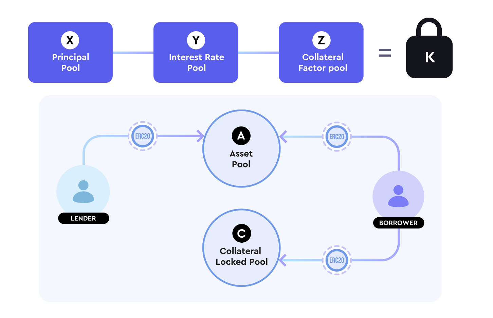
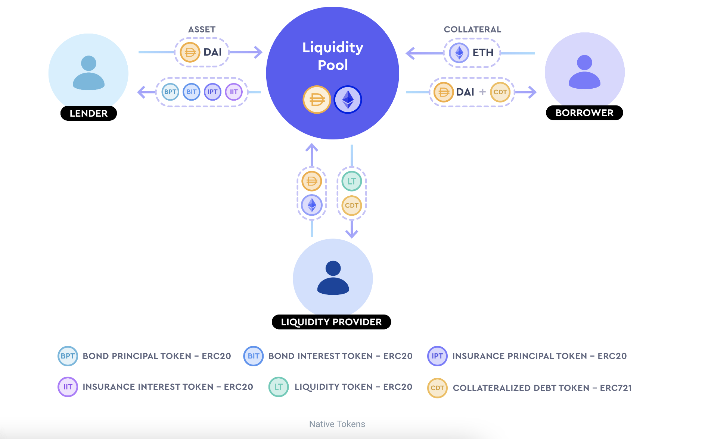
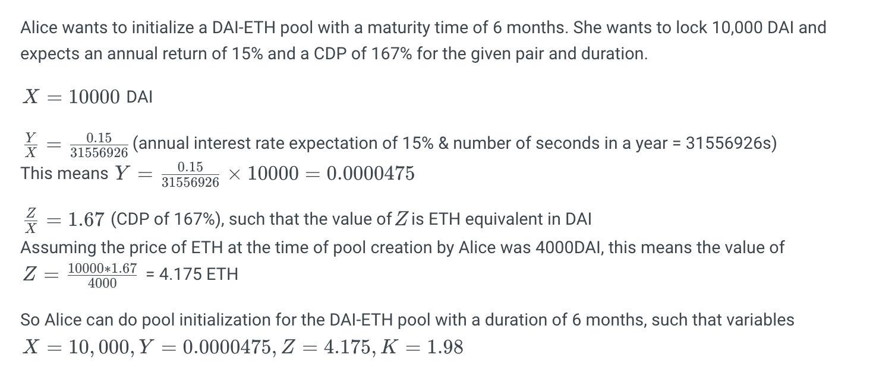

## Project Docs

### Intro

- First fully decentralized AMM based money market protocol
- Oracle free
- No liquidations - interesting... no liquidation penalty and dependence on liquidators
- Permission-less fixed maturity lending & borrowing— anyone can create pool for borrowing/lending ERC20
- non custodial
- Market driven interest and collateral - asset in pool determines interest rate
  and collateral required
- 3 variable AMM is motivated by the constant product AMM used by Uniswap
- allows users to decide their risk profile
- accordingly set interest rate for risk profile

- x*y*z = k
- x - principal pool, y - interest rate pool, z - collateral factor pool
- As lenders and borrowers engage in transactions with the pool, the interest rates and minimum collateral requirements dynamically change according to the constant product formula

- arbitageurs can come in if any dislocations in interest rate and collateral factor

### Risk

- Timeswap lenders have a proportional claim to the underlying collateral staked by borrowers in the event of default via the insurance token model

- Full autonomy to users to decide their own risk-reward profile

### Concepts

- 3 players - lenders/borrowerd and LPs
- use case - strong use case is 1. to short long tail assets 2. borrow in illiquid assets 3. anyone can create a lending pool with a given risk/reward profile 4. fixed time preference

- lenders

  - earn yield on long tail assets with no MMs
  - higher yield on assets that compensates for non liquidatable nature
  - cparty risk limited to a single token
  - arb yield
  - provide liquidity for early stage projects without IL

- borrowers

  - debt financing of early stage projects
  - short erc20 without liquidation risk
  - borrow uses nft or lp tokens as collateral

- lps
  - use lp tokens of other protocols as collateral
  - earn fees

### Oracle less

- oracles have pricing risk
- timeswap pools are self sufficient
- have their own native interest rate & collateral factor discovery mechanism.
- if borrower doesn't pay, collateral is liquidated and distributed to lenders based on insurance token holdings
- No liquidations till maturity

### AMM

- (X) Principal Pool is a virtual pool and is equal to the amount of assets in the pool that can be borrowed. It's equal to the sum of the assets deposited by the lender

- (Y) Interest Rate Pool is a virtual pool that determines the interest amount per second of the pool, such that ratio Y/X is the per second **maximum** interest rate for a particular token pair at the time of transaction for remaining duration of the pool

- (Z) Collateral Factor Pool is a virtual pool that determines the collateral to be locked by the borrowers such that ratio X/Z is equal to the **minimum** collateral debt percentage of a pool for a particular token pair at the time
  of transaction for remaining duration of pool.

- X/Z is used to calculate the expected average loan to value at the time of the transaction

- (K) - Invariance Constant product

```
X * Y * Z = K
```



- There are 2 other pools

- (C) Collateral Locked Pool and is equal to the amount of ERC20 collateral tokens locked in the pool by borrowers

- (A) Asset Pool and is equal to the amount of ERC20 asset tokens locked in the pool. It is the sum of assets lent by lenders & the debt paid by the borrowers

- Note that A is a real pool whereas X is a vitual pool - `X` `Y` and `Z` are all virtual pools

### Tokens

- 4 native tokens - each timeswap pool offers 5 ERC20 and 1 ERC721 token

  - Bond principal token (20)
  - Bond interest token (20)
  - Insurance principal token (20)
  - Insurance Interest token (20)
  - liquidity tokens (20)
  - Collateralized Debt token (721)

- Each of the ERC20 token contracts has an underlying ERC20 token with a fixed maturity date.

- An ERC721 Collateralized Debt Token contract has an underlying debt in terms of an ERC20 token, underlying collateral in terms of the paired ERC20 token, and a fixed maturity date.

Following is token flow chart



**Bond Principal Token**

- represent the exact claim on the assets in the Asset pool after maturity, including assets repaid by the borrowers.

- recipients of the Bond Principal tokens are the lenders who lent the underlying ERC20 asset tokens into the Principal pool.

- Bond Principal tokens essentially accounts for the exact Principal owed after maturity to the lenders which is equal to the asset lent.

- An owner of the Bond tokens can burn them after the maturity date, to withdraw the exact same amount of the underlying asset tokens in the Principal pool.

- For example, consider a user who owns 30 Bond Prinicipal tokens of a DAI/WETH pool expiring on 12-30-2022. Assuming a total supply of 500 Bond Principal tokens held by all the lenders and a total of 1200 DAI assets in the Principal pool, the user, then, can swap his tokens for 30 DAI after 12-30-2021.

**Bond Interest Token**

- Bond Interest tokens represent the exact claim on the remaining assets in the Asset pool after the Bond Principal Token settlement is done after maturity

- Bond Interest tokens essentially accounts for the exact Interest owed after maturity to the lenders.

- An owner of the Bond Interest tokens can burn them after the maturity date, to withdraw the exact same amount of the underlying asset tokens in the Principal pool provided there are enough assets to pay for all the lenders claim, if not than the claim is done proportionally based on total Bond Interest token holding of all lenders .

**Insurance Principal Token**

- Insurance Principal token holder gets the claim to the collateral defaulted by the borrower after maturity equal to the percentage of unrealized assets from Bond tokens on the insurance coverage held by the lender.

- If there is no default on Bond Principal Token than insurance principal token doesnt activate

- Insurance Principal tokens help to protect the lenders only when Bond Principal tokens are not able to withdraw the same amount of assets from the principal pool.

- The recipients are the lenders who lent into the pool and chose to get the insurance coverage on the default from borrowers.

- This can happen when assets in the principal pool are less than the total Bond Principal tokens held by all lenders.

- An owner of the Insurance Principal token can burn it after the maturity date to withdraw up to the same percentage of the amount of insurance tokens.

- For example, suppose the same user owns 1 Insurance Principal token of a pool expiring on 12-30-2022. Supposedly the user was not able to realize 20% of his bond principal token claim, this means the lender can now claim up to 0.2 WETH collateral from the collateral pool.

**Insurance Interest Token**

- Insurance Interest token holder gets the claim to the collateral defaulted by the borrower after maturity equal to the percentage of unrealized assets from Bond Interest tokens

- If there is no default on Bond Interest Token than insurance interest token doesnt activate

- Insurance Interest tokens help to protect the lenders only when Bond Interest tokens are not able to withdraw the same amount of assets from the principal pool.

**Collateralized debt tokens**

- The recipients are the borrowers. An owner of the collateralized debt tokens can burn them to withdraw the proportional collateral locked when the underlying proportional debt is paid before the maturity date

- For example, there is a user who owns a Collateralized Debt token of a pool expiring on 12-30-2021 with 2 WETH locked as collateral against a debt of 300 DAI

- If the user repays 300 DAI debt before 12-30-2021, the user can burn his/her collateralized debt tokens to withdraw the 2 WETH locked as collateral.

- If the user did not pay the 300 DAI debt, the collateralized debt tokens will lose the repay debt functionality, thus, the user will never be able to withdraw the staked collateral.

**Liquidity tokens**

- Liquidity tokens gives the token holders the claim to existing liquidity i.e. assets in the Principal pool and collateral locked in the Collateral Pool after the claims of lenders are realized

- The recipients are the liquidity providers who add liquidity into the pool. After maturity, they can burn their liquidity tokens to withdraw their liquidity from the pool

**How it works**

_Lenders_

- Lenders get bond and insurance tokens (bond principal + bond interest)
- At maturity, lender redeems principal token to get back asset that was lent
- At maturity, lender redeems interest token to get back interest in the other token


```
For lenders...

(X+dX)*(Y - dY)*(Z-dZ) = K

```


- As `X` increases, reserves of `Y` and `Z` have to decrease to maintain constant product

- As `Y` increases, `Z` has to decrease and vice versa

_Borrowers_

- Borrow tokens with fixed interest value and fixed maturity setting
- They lock collateral stakes at whatever amount they are comfortable over and above a minimum collateral derived by the AMM.
- The collateral locked will never be liquidated in the life of the debt.
- Borrowers have to pay the debt before maturity time to withdraw their collateral stake, if not, their collateral will be distributed to lenders.

- Near maturity time, when the value of the collateral is greater than the value of debt, we expect the borrower to pay the debt, but when the value of the collateral is less than the value of debt, we expect them to default.

- It is this rational behavior why the price feeds and oracles are not needed in the protocol. Liquidation happens automatically based on the decisions of each borrower.


```
For borrowers...

(X-dX)*(Y + dY)*(Z+dZ) = K

```


- As `X` decreases, reserves of `Y` and `Z` have to increase to maintain constant product

- As `Y` increases, `Z` has to decrease and vice versa

_Liquidity Providers_

- Liquidity providers are the market makers of the pool.
- They add tokens into the pool and make both lending and borrowing transactions at the same time.

- They earn a spread between lenders and borrowers which is based on the number and size of transactions of the pools.

- They help add liquidity to facilitate transactions between lenders and borrowers.

```
(X+dX)*(Y+dY)*(Z+dZ) = K
```

Vaules of `dX`, `dY` and `dZ` is calculated to maintain same ration between `X`, `Y` and `Z` such that

```
x = rX, y = rY, z = rZ
```

**Intuitive interpretation**

Here is workflow


Here is an example to setup a pool



**Lending**

- `x` be increase in `X` pool. This increase is due to the lender depositing `x` assets in the pool.
- Let `y` be the decrease in the `Y` pool
- Let `z` be decrease in `Z` pool

Value of `x`, `y`, `z` calculated from constant product `K`

```
    (X+x)*(Y-y)*(Z-z) = K
```

- For a give `x`, as `y` increases `z` should decrease
- User increases lower interest as insurance increases and vice versa
- **Lenders have a choice to pick an appropriate `risk-reward` file**


- Maximum of `y` is when `z` = 0

```
(X+x)*(Y-y_max)*(Z-0) = K
```

- Maximum of `z` is when `y` = 0

```
(X+x)*(Y-0)*(Z- z_max) = K

```

- Let `d` be time duration from the time of user transaction to maturity time of pool in seconds

```
Total Bond tokens and Insurance tokens received by lenders are as follows:

    Bond Principal tokens:   x

    Bond Interest tokens: d * y

    Insurance principal token: z_max

    Insurance interest token: z * d / 2 ^ 25

    y -> minimum value can be y_max / 16 (minimum interest per second received by lenders)
```
