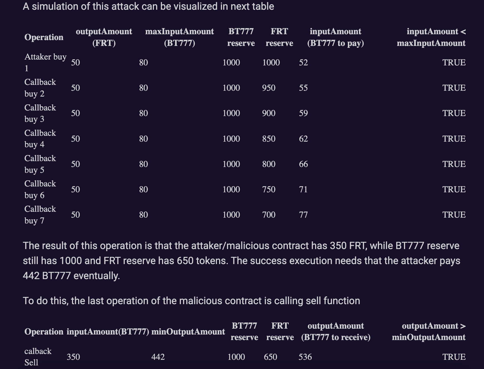
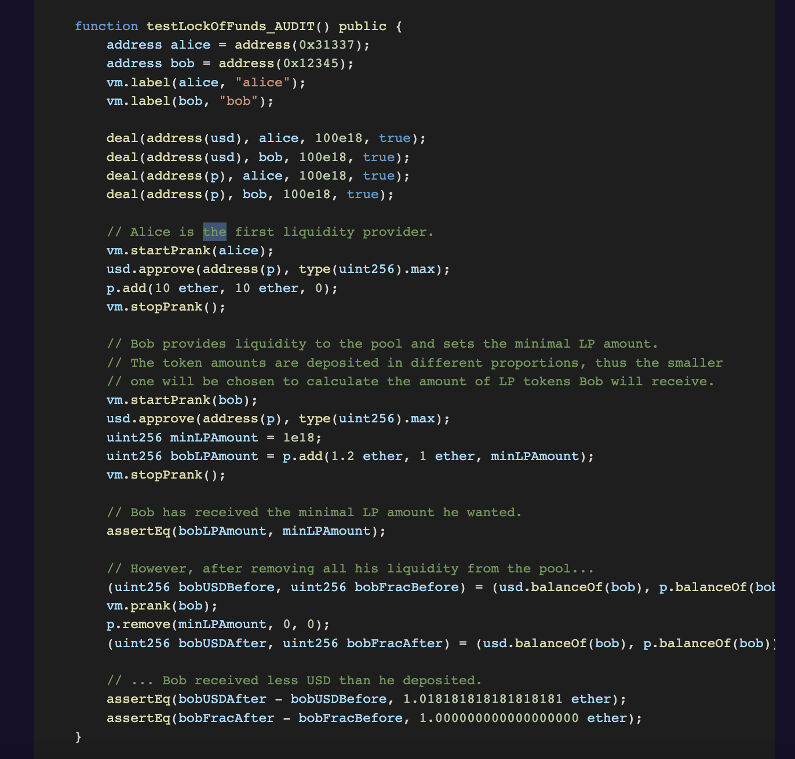
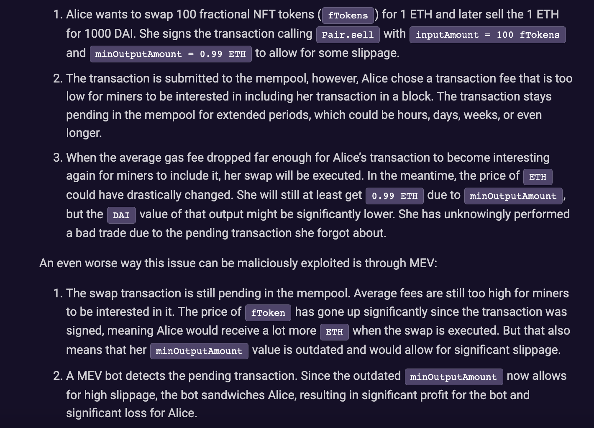

# Caviar Findings

## Background

I did this audit - did not get any findings in this one. Link to the final report is [here](https://code4rena.com/reports/2022-12-caviar/). Github issues can be found [here](https://github.com/code-423n4/2022-12-caviar-findings/issues). Codebase that was audited can be found [here](https://github.com/code-423n4/2022-12-caviar)

**Introduction**

- Caviar is a NFT For AMMs
- LP's add NFTs and ERC20 tokens into a pool in exchange for a % of fees the AMM generates
- Caviar assigns a desirability to pools and groups them into category 1/ category 2 etc
- All NFT's in a goven pool have similar desirability
- Floor price of these NFT's is used to fractionalize them into new ERC20 tokens
- You can add NFTs and ERC20 tokens to pool -> mint LP tokens
- You may burn LP tokens - and get back the NFT
- The logic is split into 3 parts
  - Core AMM - stripped down version of UNI-V2 that handles swapping between base token (WETH or USDC ) and fractional NFT token
  - NFT wrapping - logic that enables users to wrap NFTs and get fractional tokens or vice versa
  - NFT AMM helpers - logic is a set of helper functions that wrap around core AMM and NFT wrapping logic

---

## High Risk Issues

### 01- Re-entrancy in buy function for ERC-777 tokens allows buying fractional tokens at considerable discount

**Vulnerability**

- If the Base Token against which the fractional reserve token is paired is a ERC777 token (an extension of ERC20), then user can define a malicious contract implementing the `IERC777Recipient` - this is the interface of `ERC777TokensRecipient` defined in EIP. This allows the account holder to be notified when IERC777 tokens are being sent to them by having a contract implement this interface. In the `tokensReceived` hook, a user can re-enter the `buy` and `sell` functions defined [here](https://github.com/code-423n4/2022-12-caviar/blob/0212f9dc3b6a418803dbfacda0e340e059b8aae2/src/Pair.sol#L166)

Notice that in `buy`, `sell` functions that allows users to buy or sell fractional tokens in exchange of base tokens, transfer of `base` token is done AFTER transfer of `fractional` tokens. in the `_transferFrom` function, balances of fractional owner are changed. The `buyQuote` function is vulnerable to a re-entrancy attack because it assumes that the balances of base token and fractional tokens are fixed & that their ratio determines the price

```
    function buyQuote(uint256 outputAmount) public view returns (uint256) {
        return (outputAmount * 1000 * baseTokenReserves()) / ((fractionalTokenReserves() - outputAmount) * 997);
    }
```

If the base token is ERC777, then we can re-enter buy/sell functions before the actual transfer happens. The idea presented by the auditor is that we can create a malicious contract with a counter that tracks number of callbacks - we can run `buy` function with 6 callbacks (at which point the inputAmount > maxInputAmount), and we no longer can call the `buy`. At this point, we use all the FRT tokens we received in the `buy` callbacks and call the `sell` function to sell all FRT for the base token -> and we use the base tokens bought to pay off the pening base token balance in all the `buy` callbacks.

After all transactions are completed, we will end up with FRT tokens for free. By repeatedly doing this, auditor has shown that if base token is ERC777, they can drain the base tokens by generating FRT tokens and exchanging them for base tokens

**Proof of Concept**

- Let’s suppose the pair has 1000 base tokens(BT777) and 1000 Fractional reserve tokens (FRT)
- The attacker call buy function, all with next inputs:

  outputAmount = 50
  maxInputAmount = 80

- The attacker implements a hook, that will be executed 6 times (using a counter inside a malicus contract) when a transfer is done, and call the buy function. After this 6 times the malicious contract is call again, but this times calls the sell function, doing a huge sell for the fractional reserve token obtained.



**Recommendation**

- Add `nonReentrant` modifier if the protocol intends to allow ERC777 tokens as base tokens
- Or explicitly state that ERC 777 tokens are not supported

(Protocol has said they never intend to allow ERC 777. but accepted it as technically valid)

**Key learning**

- Whenever a protocol specifies ERC 20 token and leaves it a choice to users to specify tokens, always explore the possibility of using ERC777 token -> it passes all checks that a ERC20 token passes
- But it has a killer feature of `hooks` that can catch any token transfers -> and allow re-entrancy. In such cases re-entrancy cases are a real risk, if protocol does not take care of this, it can lead to high risk vulnerabilities

### 02- Liquidity Providers can lose funds when adding liquidity

**Vulnerability**

`AddQuote` function calculates the lpTokenAmount received by a user as a minimum of `baseTokenShare` and `fractionalTokenShare` in [Line 420 of Pair.sol](https://github.com/code-423n4/2022-12-caviar/blob/0212f9dc3b6a418803dbfacda0e340e059b8aae2/src/Pair.sol#L420-L423)

This would mean that a user can send excess amount of `baseTokenAmount` or `fractionalTokenAmount` and yet receive LPtokens corresponding to minimum reserves

However in the [`add` function](https://github.com/code-423n4/2022-12-caviar/blob/0212f9dc3b6a418803dbfacda0e340e059b8aae2/src/Pair.sol#L63), there is no provision to adjust for any excess sent by user. Function simply transfers fractionalTokenAmount and baseTokenAmount from the user -> this would mean that user can lose his funds & yet receive same number of LP tokens

```
    function addQuote(uint256 baseTokenAmount, uint256 fractionalTokenAmount) public view returns (uint256) {
        uint256 lpTokenSupply = lpToken.totalSupply();
        if (lpTokenSupply > 0) {
            // calculate amount of lp tokens as a fraction of existing reserves
            uint256 baseTokenShare = (baseTokenAmount * lpTokenSupply) / baseTokenReserves();
            uint256 fractionalTokenShare = (fractionalTokenAmount * lpTokenSupply) / fractionalTokenReserves();
            return Math.min(baseTokenShare, fractionalTokenShare);
        } else {
            // if there is no liquidity then init
            return Math.sqrt(baseTokenAmount * fractionalTokenAmount);
        }
    }
```

**Proof of Concept**

Auditor has written a nice test case to show how a user can lose his funds. Something to learn here, in terms of writing neat test cases



**Recommendation**

In `add` function, consider calculating optimal amounts needed and only transfer so much from users. Protocol fixed this by giving a minimum and max price that users are willing to LP at along with `minLptokenAmount` that they would like to receive.

**Key learning**

- Whenever there is a `minimum` defined for user funds, there is always a scope that user transfers more than that minimum.
- Consider following scenarios

  - A user transfering excess will lose those funds becauase protocol is not considering to account for balance
  - Any adverse impact of sending excess funds -> for example, is it possible to disrupt the constant product AMM by sending excess of 1 tokens

- I have found this vulnerability while looking at `Timeswap`

### 03- First depositor can break minting of shares

**Vulnerability**

- This is kind of templatized vulnerability of AMMs. People who know it can spot it quickly -> relates to the initial LP token minting. If a user deposits a very small amount of initial deposit & then directly deposits a large amount of pait rokens without minting LP tokens, a small LP token represents a huge amount of pair tokens. All normal deposits by regular users thereafter results in rounding errors and they will receive 0 LP tokens

**Proof of Concept**
By depositing the absolute minimum when creating a pool (say 1 wei Base token & 1 wei fractional token), first LP can mint 1 wei of LP. Immediately after, he deposits a large amount of base/fractional token directly into the paid (without minting LP tokens), say 1e9 base/ftt token. Since no new LP tokens are minted, 1 wei represents this large 1e9 base/ftt token.

Afterwards, any new depositor depositing into the pool will be rounded to 0 LP tokens if they deposit <1e9 tokens.

```
baseTokenShare = (X * 1) / 1e9;
fractionalTokenShare = (Y * 1) / 1e9;
```

**Recommendation**

- Uniswap solved this by sending first 1000 LP tokens to address(0). Check link [here](https://github.com/Uniswap/v2-core/blob/master/contracts/UniswapV2Pair.sol#L119-L124)

**Key Learning**

- In AMMs, always look for how initial LPs are minted - if they are not minting excess LP tokens, then explore if a possibility of pool manipulation exists

- This is a templatized error that is usually high risk

---

## Medium Risk Issues

### 04- Missing deadline check on AMM transactions (buy/sell/add/remove)

**Vulnerability**

The `Pair` contract does not allow users to submit a deadline for their action. This missing feature enables pending transactions to be maliciously executed at a later point.

There is no `deadline` in inputs of [`add` function](https://github.com/code-423n4/2022-12-caviar/blob/0212f9dc3b6a418803dbfacda0e340e059b8aae2/src/Pair.sol#L63). Same is case for `subtract`, `sell`, `remove`

AMMs should provider users with deadline - or else, stale transactions can be executed maliciously my MEV bots -> transactions that are not accepted by miners due to low fees & have been in mempool for long time but such transactions have become attractive to execute now (could be because of huge change in ETH or base token prices). Although there is a `minLPToken` check in `add`, `minBaseTokenAmount` and `minFractionalTokenAmount` in `remove`, such values might be stale and could lead to huge slippage for user

**Proof Of Concept**

Explained nicely here:



**Recommendation**

Introduce a deadline for validity of transactions

**Key learnings**

- Exchange based transactions with minimum amounts are always subhected to slippage if market moves hugely
- this can happen if txns don't have a deadline & for some reason, were not executed on time
- in such cases, stale txns get executed and user will lose to slippage & MEV bots will gain by sandiwiching user transactions

### 05- Price will not always be in 18 decimals. As expected and outlined in comments

**Vulnerability**
The `price()` function is expected to return the price of one fractional tokens, represented in base tokens, to 18 decimals of precision. This is laid out clearly in the comments:

```
/// @notice The current price of one fractional token in base tokens with 18 decimals of precision.
/// @dev Calculated by dividing the base token reserves by the fractional token reserves.
/// @return price The price of one fractional token in base tokens * 1e18.

```

However, the formula incorrectly calculates the price to be represented in whatever number of decimals the base token is in.
Since there are many common base tokens (such as USDC) that will have fewer than 18 decimals, this will create a large mismatch between expected prices and the prices that result from the function.

**Proof of concept**

Price is calculated as below

```
return (_baseTokenReserves() * ONE) / fractionalTokenReserves();
```

Here `ONE` represents `1e18`. Fractional token reserves will always be 18 decimal -but same cannot be said about base token reserves. If `USDC`, then `ONE` and `fractionalTokenReserves` will cancel out each other and we are left with `baseTokenReserves` . Suppose we have 1000 USDC, 1000 $FTT in the reserve -> above formula gives us `1e9 * 1e18/1e21` = `1e6`. If we expect price to be in `1e18`, then value will be interpreted as `1/1e12` tokens whereas it should actually be `1 token` -> this can lead to huge price discrepancy and break down logic of AMM and LP tokens

**Recommendation**

Change the formula to

```
return (_baseTokenReserves() * 10 ** (36 - ERC20(baseToken).decimals()) / fractionalTokenReserves();
```

For base token with 18 decimals - this will just break down to above formula. For all other non-standard tokens, this will give a correct representation of token amounts in 18 decimals

**Key learning**

- Most decimal errors are due to rebasing non-standard tokens to 18 decimals. This error is easy to creep in - always devote some time to check if protocol is correctly accounting for decimals

### 06- Rounding error in `BuyQuote` might result in free tokens

**Vulnerability**
In order to guarantee the contract does not become insolvent, incoming assets should be rounded up, while outgoing assets should be rounded down.

This property is applicable in all token pair systems - when depositing, we should round up (as general principle) and when withdrawing, we should round down. I saw a ton of rounding in `Timeswap` audit but wasn't equipped to judge whether roundings are correct - key is to make sure protocol says solvent at all time.s

`buyQuote` allows users to buy fractional tokens for a given amount of base tokens - in this function, base tokens are rounded down (which is in favor of buyer). Depending on the amount of current token reserves and the amount of fractional tokens the user wishes to buy, it might be possible to receive free fractional tokens.

```
 /// @notice The amount of base tokens required to buy a given amount of fractional tokens.
    function buyQuote(uint256 outputAmount) public view returns (uint256) {
        return (outputAmount * 1000 * baseTokenReserves()) / ((fractionalTokenReserves() - outputAmount) * 997);
    }
```

**Proof of concept**

- Assume the following reserve state:

  - base token reserve - 0.1 WBTC (1e7)
  - ftt reserve - 10 million (1e25)

- user wants to buy 0.9 ftt (9e17). `buyQuote` will give
  `(9e17 * 1000 * 1e7) / ((1e25 - 9e17) * 997) = 0,903`

- This turns to 0 -> rounding error

- So in this case, user can get 0.9 ftt for free.

But,

- Repeated such attacks can decrease FTT reserve and the rounding error might no longer exist - at some point, we get back >1 base amount
- 30 bps fee would mean that such attacks are not so viable

**Recommendation**

- For incoming assets, it’s recommended to round up the required amount.
- Use `FixPointMathLib` of solmate to calculate and round up

`function buyQuote(uint256 outputAmount) public view returns (uint256) {
  return mulDivUp(outputAmount * 1000, baseTokenReserves(), (fractionalTokenReserves() - outputAmount) * 997);
}`

### 07- Its possible to swap nft token ids without fee and an attacker can wrap/unwrap all NFT token balance of the pair contract and steal their airdrops for those token ids

**Vulnerability**

- Users can wrap() their NFT tokens (which id is whitelisted) and receive 1e18 fractional token or they can pay 1e18 fractional token and unwrap NFT token. there is two issue here:

  - anyone can swap their NFT token id with another NFT token id without paying any fee(both ids should be whitelisted). it’s swap without fee.

  - attacker can swap his NFT token(with whitelisted id) for all the NFT balance of contract and steal those NFT tokens airdrop all in one transaction.

  I gave this same finding -> you can swap a lower priced NFT with a higher priced one - somehow that got rejected altogether.

  **Proof of concept**

  - if Pair contract is for NFT1 and baseToken1 and also merkle tree root hash is 0x0.
  - users deposited 100 NFT1 tokens to the Pair contract.
  - NFT1 decide to airdrop some new tokens for token holders and token holders need to call nft.getAirDrop(id) while they own the NFT id.
  - attacker would create a contract and buy one of the NFT1 tokens (attackerID1) and wrap it to receive 1e18 fractional tokens and perform this steps in the contract:

    - loop through all the NFT tokens in the Pair contract balance and:
    - unwrap NFT token id=i from Pair contract by paying 1e18 fractional token.
    - call nft.getAirDrop(i) and receive the new airdrop token. (the name of the function can be other thing not exactly getAirDrop())
    - wrap NFT token id=i and receive 1e18 fractional token.

    **Recommended mitigation**

    - create functionality so admin can call getAirDrop() functions during the airdrops before attacker.
    - create some delay for unwrapping tokens and if user wants to unwrap token he would receive it after this delay.

    **Key learnings**

    - This was specific to this particular platform where NFT's wer ekind of fungible because you could exchange any NFT for like 1e18 ftt

    - someone can claim all airdrops on one NFT is definitely a problem I could see - maybe the way I explained was incorrect

### 08- Pair price maybe manipulated by direct transfers to the pool

**Vulnerability**

- the `buyQuote` function is using the `balanceOf` function to compute base and fractional token reserves. This leaves the price open to manipulation if someone sends a different proportion of `base` and `FTT` tokens. If price from this AMM is used as a price oracle elsewhere, then such price would be prone to manipulation by direct transfers

```
function baseTokenReserves() public view returns (uint256) {
    return _baseTokenReserves();
}
function _baseTokenReserves() internal view returns (uint256) {
    return baseToken == address(0)
        ? address(this).balance - msg.value // subtract the msg.value if the base token is ETH
        : ERC20(baseToken).balanceOf(address(this));
}
function fractionalTokenReserves() public view returns (uint256) {
    return balanceOf[address(this)];
}
```

**Recommendation**

Consider tracking pair’s reserves internally, using state variables, similarly to how Uniswap V2 does that:

```
uint112 private reserve0;           // uses single storage slot, accessible via getReserves
uint112 private reserve1;
```

```
function getReserves() public view returns (uint112 _reserve0, uint112 _reserve1, uint32 _blockTimestampLast) {
    _reserve0 = reserve0;
    _reserve1 = reserve1;
    _blockTimestampLast = blockTimestampLast;
}
```

**Key Learning**

Note that in this case, price is a function of balances - there is no separate accounting balance kept to track the prices. This introduces vulnerability -> by adding tokens to the pool in varied proportions, price can be moved

This is an adverse effect of computing via pool balances - it is important to observe all side effects to incoming transfers (which are in user control). Although this will cause a loss to transferrors, he maybe hoping to exploit the hack and profit later
