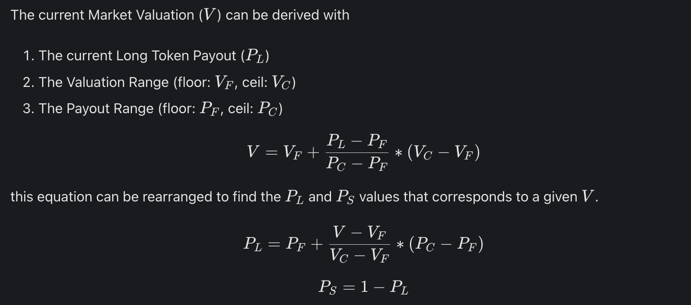

# PrePO Findings

## Background

This was my first audit -> started my journey as an auditor. This will always be a special audit - I found a `high` risk vulnerability in this audit & 2 of my findings got accepted and I received my first payout of $239. Here is [code repo](https://github.com/code-423n4/2022-12-prepo) for audit, [findings repo](https://github.com/code-423n4/2022-12-prepo-findings) and [final findings report](https://code4rena.com/reports/2022-12-prepo#scope) .

---

## Protocol Key Points

- prePO is a decentralized trading platform allowing anyone, anywhere to speculate on the valuation of any pre-IPO company or pre-token project.

- All investors miss out on opportunities due to there being limited places on a cap table.

- With prePO (short for 'pre-IPO'), an unlimited number of new seats can be created around the cap table - unlocking access for all.

- Traders will be able to take synthetic positions on pre-IPO companies such as SpaceX, Stripe, Gemini, and ByteDance

- Liquidity Providers (LPs) on prePO don't have to take a long or short position, and they face no liquidation risk.

- LP positions are Risk Minimised. With the right market parameters, LPs face single-digit maximum loss, which is more than compensated for with 3 Layers of Rewards.

- **3 actors**

  - LPs provide liquidity in the form of USD stablecoins to prePO Markets
  - Traders open long or short positions in prePO Markets, the net sum of their activity determining estimated valuations of pre-public entities. Trader could be making a loss on a WeWork long position, but still make an overall profit due to PPO incentives and collateral farming!
  - we have PPO token stakers, who participate in the prePO DAO governance system.

- **PreCT tokens (collateral)**

  - All prePO positions are backed by preCT (prePO Collateral Tokens).
  - preCT is backed by a basket of yield bearing USD stablecoins
  - Positions being backed with preCT means Traders and LPs receive passive yield on all of their prePO assets.

- **Markets**

  - Markets consist of Long Tokens and Short Tokens which rise and fall in value with the estimated valuation of a particular pre-public entity and AMM Pools which facilitate the exchange of Long Tokens and Short Tokens between Traders.

  - Creation is proposed and voted by PrePO governance
  - _Valuation range_ - A range between two fully-diluted valuations (also known as fully-diluted market capitalization)
  - _Payout range_ - A range between 0% - 100% representing the minimum and maximum portion of a preCT an L or S can be redeemed for in a market
  - _Expiry_ - Expiry date of the market. If a market has not settled by its expiry date, it will automatically settle at the lower bound of its Valuation Range.

  - **Long And Short Tokens**

    - Long Tokens (L) increase in value as the estimated valuation of the market increases
    - Short Tokens (S) increase in value as the estimated valuation of the market decreases.
    - At any time 1 preCT can be deposited in Market to mint `1L` + `1S`. Conversely, `1L + 1S` is always equal to `1preCT`
    - Inverse relation between long and short tokens is as follows:

    

    - Here is the token pricing math

    

    - When P<sub>L</sub> goes up, `V` goes up. When P<sub>L</sub> goes down, `V` goes down
    - P<sub>L</sub> and P<sub>S</sub> are inversely correlated
    - When P<sub>L</sub> = P<sub>F</sub>, V = V<sub>F</sub>
    - When P<sub>L</sub> = P<sub>C</sub>, V = V<sub>C</sub>

  - **Liquidity Pool**

    - Every Market is initialized with two Uniswap V3 AMMs.
    - One AMM trades `L/preCT` tokens, another trades `S/preCT` tokens
    - Traders can easily buy `L` and `S`exposure using these AMMs
    - Concentrated liquidity allows LPs to provide liquidity only across the Payout Range, greatly improving their capital efficiency.
    - Arbitrage incentives ensure P<sub>L</sub> = 1 - P<sub>S</sub>

- **Market Settlement**
  - When a market receives an official public valuation, prePO Governance will create a proposal to settle the market at that valuation.
  - for companies it is fully diluted mkt cap at the end of first day of trading
  - for protocols, this is the time-weighted average fully-diluted market capitalization over the first three days of public trading or or the fully-diluted market capitalization at the conclusion of an IDO/IEO/ICO.
  - Once market is settled, `L` and `S` may be redeemed at pre-agreed values of `preCT` (since prices are fixed)

---

## High Risk Findings

### H01- Griefing / blocking and delaying users to withdraw

**Vulnerability**
[`hook` function](https://github.com/prepo-io/prepo-monorepo/blob/3541bc704ab185a969f300e96e2f744a572a3640/apps/smart-contracts/core/contracts/WithdrawHook.sol#L66-L72) is responsible for allowing users to withdraw collateral - each user can withdraw upto a user limit in a given epoch. Suppose a user withdraws upto max user limit in a given epoch - for next epoch, as long as the user is NOT the first one to withdraw, the condition in the `else` (check code snipped below) would mean that the user will see a DOS. This is because the `userToAmountWithdrawnThisPeriod[_sender]` is not being reset to 0 for a new epoch and `lastUserPeriodReset` is same for every user - once set in a given epoch, user has to wait to be the first one in the queue to withdraw. This can cause undue delay to user withdrawals

```
    if (lastUserPeriodReset + userPeriodLength < block.timestamp) {
      lastUserPeriodReset = block.timestamp;
      userToAmountWithdrawnThisPeriod[_sender] = _amountBeforeFee;
    } else {
      require(userToAmountWithdrawnThisPeriod[_sender] + _amountBeforeFee <= userWithdrawLimitPerPeriod, "user withdraw limit exceeded");
      userToAmountWithdrawnThisPeriod[_sender] += _amountBeforeFee;
    }
```

**Relevant Code**
https://github.com/prepo-io/prepo-monorepo/blob/feat/2022-12-prepo/apps/smart-contracts/core/contracts/WithdrawHook.sol#L66-L72

**Proof of Concept**

Auditor has built a nice test case to demonstrate this DOS attack in the [git issues](https://github.com/code-423n4/2022-12-prepo-findings/issues/116).

```
  describe('user withdraw is delayd', () => {
    beforeEach(async () => {
      await withdrawHook.setCollateral(collateral.address)
      await withdrawHook.connect(deployer).setWithdrawalsAllowed(true)
      await withdrawHook.connect(deployer).setGlobalPeriodLength(0)
      await withdrawHook.connect(deployer).setUserPeriodLength(TEST_USER_PERIOD_LENGTH)
      await withdrawHook.connect(deployer).setGlobalWithdrawLimitPerPeriod(0)
      await withdrawHook.connect(deployer).setUserWithdrawLimitPerPeriod(TEST_USER_WITHDRAW_LIMIT)
      await withdrawHook.connect(deployer).setDepositRecord(depositRecord.address)
      await withdrawHook.connect(deployer).setTreasury(treasury.address)
      await withdrawHook.connect(deployer).setTokenSender(tokenSender.address)
      await testToken.connect(deployer).mint(collateral.address, TEST_GLOBAL_DEPOSIT_CAP)
      await testToken.connect(deployer).mint(user.address, TEST_GLOBAL_DEPOSIT_CAP)
      await testToken.connect(deployer).mint(user2.address, TEST_GLOBAL_DEPOSIT_CAP)
      await testToken
        .connect(collateralSigner)
        .approve(withdrawHook.address, ethers.constants.MaxUint256)
      tokenSender.send.returns()
    })

    it('reverts if user withdraw limit exceeded for period', async () => {

      // first withdraw with the limit amount for a user
      await withdrawHook.connect(collateralSigner).hook(user.address, TEST_USER_WITHDRAW_LIMIT, TEST_USER_WITHDRAW_LIMIT)
      expect(await withdrawHook.getAmountWithdrawnThisPeriod(user.address)).to.eq(TEST_USER_WITHDRAW_LIMIT)

      // we move to a new epoch in the future
      const previousResetTimestamp = await getLastTimestamp(ethers.provider)
      await setNextTimestamp(
        ethers.provider,
        previousResetTimestamp + TEST_USER_PERIOD_LENGTH + 1
      )

      // now another user is the first one to withdraw in this new epoch
      await withdrawHook.connect(collateralSigner).hook(user2.address, TEST_USER_WITHDRAW_LIMIT, TEST_USER_WITHDRAW_LIMIT)
      expect(await withdrawHook.getAmountWithdrawnThisPeriod(user2.address)).to.eq(TEST_USER_WITHDRAW_LIMIT)

      // this will revert, because userToAmountWithdrawnThisPeriod[_sender] is not reset
      // but it should not revert as it's a new epoch and the user didn't withdraw yet
      await expect(
        withdrawHook.connect(collateralSigner).hook(user.address, 1, 1)
      ).to.revertedWith('user withdraw limit exceeded')

    })
  })
```

**Recommendation**
Suggestion made by auditor is to change `lastUserPeriodResetlast` to a mapping -> for each user, there will be a specific last reset.
This way, a given user can always execute his withdrawl request without worrying about previous user limit that was not updated

```
  if (lastUserPeriodReset[_sender] + userPeriodLength < block.timestamp) {
67:       lastUserPeriodReset[_sender] = block.timestamp;
68:       userToAmountWithdrawnThisPeriod[_sender] = _amountBeforeFee;
69:     } else {
70:       require(userToAmountWithdrawnThisPeriod[_sender] + _amountBeforeFee <= userWithdrawLimitPerPeriod, "user withdraw limit exceeded");
71:       userToAmountWithdrawnThisPeriod[_sender] += _amountBeforeFee;
72:     }
```

**Key learning**

- This issue was related to lack of `state` update when a specific condition happens - in this case, other user actions could block a valid state update for a specific user. Since no user can control other users, lack of state updates leads to DOS. Understanding logic and checking documented constratinst against this logic is an important step to prevent this vulnerability.

Overall, very good find.

### H02- A whale user is able to freeze funds of others by bypassing withdraw limit

**Vulnerability**

In code snippet below, notice that first user who cabells the `hook` function to withdraw in a new epoch will be able to set `globalAmountWithdrawnThisPeriod` to `_amountBeforeFee`. For all other users, a check is done on `_amountBeforeFee` to see if the cumulative withdrawal (inclusive of `_amountBeforeFee`) would exceed the overall withdrawal limit - first user escapes this check. A whale user can withdraw everything as first user and deny withdrawals for all other users. Key vulnerability here is lack of check limits check for first user, allowing a malicious user to deny withdrawals for all other users.

```
    if (lastGlobalPeriodReset + globalPeriodLength < block.timestamp) {
        lastGlobalPeriodReset = block.timestamp;
        globalAmountWithdrawnThisPeriod = _amountBeforeFee;
    } else {
        require(globalAmountWithdrawnThisPeriod + _amountBeforeFee <= globalWithdrawLimitPerPeriod, "global withdraw limit exceeded");
        globalAmountWithdrawnThisPeriod += _amountBeforeFee;
    }
    if (lastUserPeriodReset + userPeriodLength < block.timestamp) {
      lastUserPeriodReset = block.timestamp;
      userToAmountWithdrawnThisPeriod[_sender] = _amountBeforeFee;
    } else {
      require(userToAmountWithdrawnThisPeriod[_sender] + _amountBeforeFee <= userWithdrawLimitPerPeriod, "user withdraw limit exceeded");
      userToAmountWithdrawnThisPeriod[_sender] += _amountBeforeFee;
    }
```

**Relevant Code**
https://github.com/prepo-io/prepo-monorepo/blob/3541bc704ab185a969f300e96e2f744a572a3640/apps/smart-contracts/core/contracts/WithdrawHook.sol#L61
https://github.com/prepo-io/prepo-monorepo/blob/3541bc704ab185a969f300e96e2f744a572a3640/apps/smart-contracts/core/contracts/WithdrawHook.sol#L68

**Proof of Concept**

- Collateral.sol has 10000 USDC reserve
- Withdraw limit is 150 USDC per user per period
- There are 5 users - Alpha with collateral worth 12,000 USDC, and 4 users each with 1,000 USDC
- Alpha waits for a time when request would create a new lastGlobalPeriodReset and new lastUserPeriodReset. He requests a withdraw of 10,000 USDC
- The hook is passed and he withdraws the entire collateral reserves
- At this point, victim Vic is not able to withdraw their 150 USDC. It is a freeze of funds.

---

## Medium Risk Findings

### M01 - Users do not receive owed tokens if TokenSender contract cannot cover their owed amount.

**Vulnerability**

`TokenSender.send` function returns without reverting in cases when toekn sender balance is less than amount of tokens sought. This hook is used in multiple places during `deposit`, `redeem`, `withdraw` - incases when there is no token balance, users will not receive owed tokens. And since there is no revert, it leads to a loss of tokens to users

```
function send(address recipient, uint256 unconvertedAmount) external override onlyAllowedMsgSenders {
    uint256 scaledPrice = (_price.get() * _priceMultiplier) / MULTIPLIER_DENOMINATOR;
    if (scaledPrice <= _scaledPriceLowerBound) return;
    uint256 outputAmount = (unconvertedAmount * _outputTokenDecimalsFactor) / scaledPrice;
    if (outputAmount == 0) return;
    if (outputAmount > _outputToken.balanceOf(address(this))) return; // don't send if not enough balance
    _outputToken.transfer(recipient, outputAmount);
}
```

Note above code - if output > balance in this address, it returns without reverting. The documentation in ITokenSender.sol states this is so the protocol doesn't halt the redeem and deposit/withdraw actions.

**Relevant Code**
https://github.com/prepo-io/prepo-monorepo/blob/3541bc704ab185a969f300e96e2f744a572a3640/apps/smart-contracts/core/contracts/TokenSender.sol#L41

**Proof of Concept**
Bob wants to redeem his long and short tokens via PrePOMarket.redeem(). However, Alice's redemption prior to his significantly drained the TokenSender contract of its tokens. As a result, Bob's redemption fails to benefit him in the amount of the outputToken he should have received in compensation for the fees paid.

**Mitigation**

The TokenSender contract should track users whose balance wasn't covered in a mapping, as well as a function for them to manually claim tokens later on if the contract's balance is topped up. Such a function might record the price at redemption time, or it might calculate it with the current price.

**Learning**

When `return` is used -> check if there is a financial impact -> if there is, then how is the owed balance cleared? If it is tracked, it should not be a problem as a claimer can claim later. But if not tracked, such amount leads to a permanent loss. Check if the `revert` vs `return` has an adverse financial impact. In this case, protocol chose `return` as they didn't want to DOS a user who is looking to convert long/short tokens to preCT tokens. But that choice came with a cost that was not properly addressed.

### M02 - Manager can get around min reserves check, draining all funds from Collateral.sol

**Vulnerability**

When manager withdraws collateral, there is a check if such a withdrawl drops collateral reserves below the minimum limit. Howver, such limit does not exist in the `withdraw` hook. This can be manipulated by a manager to drain the entire funds -> by combining withdrawal request (without the check) with the manager withdrawal rewquest (with the check).

**Code**
https://github.com/prepo-io/prepo-monorepo/blob/3541bc704ab185a969f300e96e2f744a572a3640/apps/smart-contracts/core/contracts/WithdrawHook.sol#L53-L79

**Proof of Concept**

Imagine a situation where the token has a balance of 100, deposits of 1000, and a reserve percentage of 10%. In this situation, the manager should not be able to make any withdrawal.

But, with the following series of events, they can:

- Manager calls deposit() with 100 additional tokens
- Manager calls managerWithdraw() to pull 100 tokens from the contract
- Manager calls withdraw() to remove the 100 tokens they added

The result is that they are able to drain the balance of the contract all the way to zero, avoiding the intended restrictions.

**Mitigation**

Add the limit check in withdrawals.

**Key learning**

Note how the auditor cleverly combined both functions to exploit the 'limit check'. By depositing preCT collateral using `deposit` followed by a `withdraw`, user is bypassing the limits. So sequence of => deposit -> manager withdraw => withdraw achieves the putpose of withdrawing any amount of tokens to byoass the pool..

If some condition applies on a specific task, check if such condition uniformly applies across all tasks. if not, ask why not?

### M03 - If admin makes a mistake and sets a wrong final payout & fixes it later, can lead to loss of protocol tokens

**Vulnerability**
A malicious/accidental update of `setFinalLongPayout` function to fix the final settlement price of the Long tokens can lead to loss of collateral in the protocol. There is currently no provision to check if a finalLongPayout is fixed already -> so an admin can theoretically call `setFinalLongPayout` function twice. In that case, long/short token holders who have redeemed tokens for preCT or about to redeem them will face a loss.

**Code**
https://github.com/prepo-io/prepo-monorepo/blob/3541bc704ab185a969f300e96e2f744a572a3640/apps/smart-contracts/core/contracts/PrePOMarket.sol#L119

**Proof of Concept**

- Suppose admin fixes the setMaxPayout as 60% (60 \* 1e16)
- Bob and Alice are the only Long/Short token holders
- Bob can redeem 1 Long tokens for .6 preCT
- Admin realizes he made a mistake and changes `setMaxPayout` to 40%
- Alice cannot redeem her Short tokens for 0.6 preCT - always reverts

**Mitigation**

- Initial `finalPayout` is set to `MAX_PAYOUT + 1` where `MAXPAYOUT` is 1e18
- Add a check `require(finalPayout > MAX_PAYOUT)`, this way it will only be called once

**Key Learning**

- Key learning here is to check if irreverseible, onlyOwner functions can be called once or many times
- If changing state of protocol can affect the payouts of users -> if yes, and if that change is permanent, it should be a vulnerability

### M04 - PrePO NFT holders can mint prePO tokens but will not be able to redeem them.

**Vulnerability**

Protocol allows NFT holders who are not in the `accountList` to mint prePO tokens. Note the above snippet in `DepositHook`.

```
  function hook(address _sender, uint256 _amountBeforeFee, uint256 _amountAfterFee) external override onlyCollateral {
-----
    if (!_accountList.isIncluded(_sender)) require(_satisfiesScoreRequirement(_sender), "depositor not allowed");
-----
  }
```

But when withdrawing, it allows withdrawal of only people in the `_accountList`

```
  function redeem(uint256 _longAmount, uint256 _shortAmount) external override nonReentrant {
-----
      _redeemHook.hook(msg.sender, _collateralAmount, _collateralAmount - _expectedFee);
-----
  }
```

Such different access criteria for minting and redeeming would mean that prePO NFT holders can mint but not redeem collateral.

**Code**
https://github.com/prepo-io/prepo-monorepo/blob/3541bc704ab185a969f300e96e2f744a572a3640/apps/smart-contracts/core/contracts/DepositHook.sol#L45
https://github.com/prepo-io/prepo-monorepo/blob/3541bc704ab185a969f300e96e2f744a572a3640/apps/smart-contracts/core/contracts/RedeemHook.sol#L18

**Proof of Concept**

Not needed

**Mitigation**

Use same criteria for mint and redeem.

**Key learning**

Access logic is important to review for functions that let users in but not out. In this case, mint had a a broader access while redeem had a narrower access. This leads to DOS attack for special users

### M05 - Frontrunning for unallowed minting of Short and Long tokens

**Vulnerability**

- The documentation states that minting of the Short and Long tokens should only be done by the governanc
- [Inline commentes](https://github.com/prepo-io/prepo-monorepo/blob/3541bc704ab185a969f300e96e2f744a572a3640/apps/smart-contracts/core/contracts/interfaces/IPrePOMarket.sol#L73) indicate that team will meant long/short tokens and capitalize liquidity pools

- `setMintHook` sets the mint hook and can be called by owner - this is not part of constructor. This means that anyone can frontrun this transaction and mint a large number of tokens

**Code**
https://github.com/prepo-io/prepo-monorepo/blob/3541bc704ab185a969f300e96e2f744a572a3640/apps/smart-contracts/core/contracts/interfaces/IPrePOMarket.sol#L73

**Proof of Concept**
Auditor has shown it using a test - before `setMintHook` any user can mint preCT, long/short tokens. Notice how minting happens before `setMintHook` is called - this shows that front running is possible - which id not possible once hook is set

```
  describe('# mint front run attack', () => {
    let mintHook: FakeContract<Contract>
    beforeEach(async () => {
      prePOMarket = await prePOMarketAttachFixture(await createMarket(defaultParams))
    })
    it('user can frontrun the set setMintHook to mint long and short tokens', async () => {

      mintHook = await fakeMintHookFixture()
      await collateralToken.connect(deployer).transfer(user.address, TEST_MINT_AMOUNT.mul(2))
      await collateralToken.connect(user).approve(prePOMarket.address, TEST_MINT_AMOUNT.mul(2))

      // we expect the mintHook to always revert
      mintHook.hook.reverts()

      // attacker frontruns the setMintHook, even we expect the mintHook to revert, we will mint
      await prePOMarket.connect(user).mint(TEST_MINT_AMOUNT)

      // governance sets the mintHook
      await prePOMarket.connect(treasury).setMintHook(mintHook.address)

      // as we expect minthook to revert if not called from treasury, it will revert now
      mintHook.hook.reverts()
      await expect(prePOMarket.connect(user).mint(TEST_MINT_AMOUNT)).to.be.reverted

      // we should now have long and short tokens in the attacker account
      const longToken = await LongShortTokenAttachFixture(await prePOMarket.getLongToken())
      const shortToken = await LongShortTokenAttachFixture(await prePOMarket.getShortToken())
      expect(await longToken.balanceOf(user.address)).to.eq(TEST_MINT_AMOUNT)
      expect(await shortToken.balanceOf(user.address)).to.eq(TEST_MINT_AMOUNT)
    })
  })
```

**Mitigation**

`_mintHook` must be set at deployment stage - this prevents any chance of minting long/short tokens

**Key learning**

- If certain actions can only be done by owner & users can access the protocol based on the rules governed by owchance ofner actions, there always exists a chance of front running

- This could be minting tokens by frontt-running a pause OR as in this case, minting before setting a `mintHook`. If such user actions are prohibited, then these owner actions should be moved to deployment

### M06 - The recipient receives free collateral token if an ERC20 token that deducts a fee on transfer used as baseToken

**Vulnerability**

- There are some ERC20 tokens that deduct a fee on every transfer call. If these tokens used as baseToken then
  - When depositing into the Collateral contract, the recipient will receive collateral token more than what they should receive.
  - The DepositRecord contract will track wrong user deposit amounts and wrong globalNetDepositAmount as the added amount to both will be always more than what was actually deposited.
  - When withdrawing from the Collateral contract, the user will receive less baseToken amount than what they should receive.
  - The treasury will receive less fee and the user will receive more PPO tokens that occur in DepositHook and WithdrawHook.

**Code**
https://github.com/prepo-io/prepo-monorepo/blob/feat/2022-12-prepo/apps/smart-contracts/core/contracts/Collateral.sol#L45-L61
https://github.com/prepo-io/prepo-monorepo/blob/feat/2022-12-prepo/apps/smart-contracts/core/contracts/Collateral.sol#L64-L78

**Proof of Concept**

**Mitigation**

- Consider calculating the actual amount by recording the balance before and after.

```
uint256 balanceBefore = baseToken.balanceOf(address(this));
baseToken.transferFrom(msg.sender, address(this), _amount);
uint256 balanceAfter = baseToken.balanceOf(address(this));
uint256 actualAmount = balanceAfter - balanceBefore;
```

- Use only the difference in balance for calculating amount of collateral tokens minted

**Key learning**

This is an important point - if code assumes that amount of deposit == amount of collateral tokens, there is always a possibility that tokens that automatically deduct fees can break the accounting logic. This is a practice I need to put in place - always check if difference in balances is used OR direct amounts are used. Its always more robust to use balance differences

### M07 - Bypass userWithdrawLimitPerPeriod check by passing balance to another account and then withdrawing

**Vulnerability**
Protocol enforces a user balance limit per epoch - this can be easily bypassed by transfering the balance to another user -> since amount to be withdrawn is checked against user address - simply transfering and withdrawing allows a single user to bypass the per epoch limit

```
function hook(
    address _sender,
    uint256 _amountBeforeFee,
    uint256 _amountAfterFee
  ) external override onlyCollateral {
...
require(userToAmountWithdrawnThisPeriod[_sender] + _amountBeforeFee <= userWithdrawLimitPerPeriod, "user withdraw limit exceeded");
...
}
```

**Code**

https://github.com/prepo-io/prepo-monorepo/blob/feat/2022-12-prepo/apps/smart-contracts/core/contracts/WithdrawHook.sol#L70

**Proof of Concept**

- Assume userWithdrawLimitPerPeriod is set to 1000
- User A has current deposit of amount 2000 and wants to withdraw everything instantly
- User A calls the withdraw function and takes out the 1000 amount
- Remaining 1000 amount cannot be withdrawn since userWithdrawLimitPerPeriod is reached
- User simply transfer his balance to his another account and withdraw from that account
- Since withdraw limit is tied to account so this new account will be allowed to make withdrawal thus bypassing userWithdrawLimitPerPeriod

**Mitigation**
User should only be allowed to transfer leftover limit. For example if User already utilized limit X then he should only be able to transfer userWithdrawLimitPerPeriod-X

**Key learning**
Missed this simple finding - > if `userToAmountWithdrawnThisPeriod` is checked against a sender, it was obvious (in hindisght) that this amount can be breached with a simple transfer to another address
