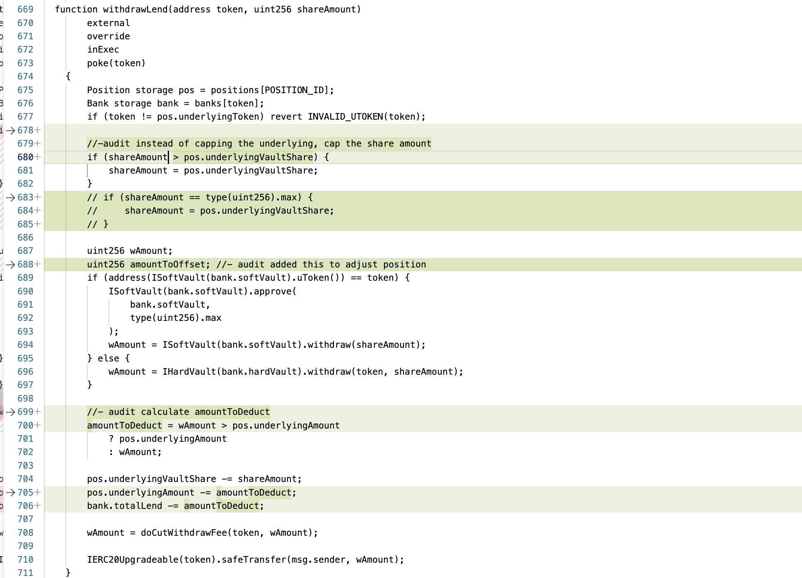

# H01 - `isLiquidatable` function underprices risk potentially preventing (or delaying) liquidations of undercollateralized positions

## Summary

Blueberry bank contract has a `isLiquidatable` function that checks if a given position is undercollateralized, and hence needs liquidation. Liquidators will call this function to check if the debt + strategy losses for a given position exceed liquidation threshold of posted collateral.

This function computes the `risk` of a position using its debt value, collateral value and underlying value. Debt value uses the unaccrued total debt that ignores the outstanding interest accrued on `cToken` borrowings. As a result, the debt value used is lesser than actual value - this leads to an `underpricing` of risk that can prevent liquidators from initiating a liquidation action. Delay in liquidations can cause undercollateralization & protocol losses.

## Vulnerability Detail

[`isLiquidatable`](https://github.com/sherlock-audit/2023-02-blueberry-0kage-eth/blob/7e59f04f7c983c0795e20851389988caa9091479/contracts/BlueBerryBank.sol#L503) function calculates risk of a given position by computing debt value, position value and underlying value in the `getPositionRisk` function.

However, debt value calculated by [`getDebtValue`](https://github.com/sherlock-audit/2023-02-blueberry-0kage-eth/blob/7e59f04f7c983c0795e20851389988caa9091479/contracts/BlueBerryBank.sol#L466) function does not include the interest accrued on `cTokens` on the outstanding debt.

```
    function getDebtValue(uint256 positionId)
        public
        view
        override
        returns (uint256)
    {
        uint256 value = 0;
        Position storage pos = positions[positionId];
        uint256 bitMap = pos.debtMap;
        uint256 idx = 0;
        while (bitMap > 0) {
            if ((bitMap & 1) != 0) {
                address token = allBanks[idx];
                uint256 share = pos.debtShareOf[token];
                Bank storage bank = banks[token];
                uint256 debt = (share * bank.totalDebt).divCeil( //-audit totalDebt here does not include the accrued component since last update
                    bank.totalShare
                );
                value += oracle.getDebtValue(token, debt);
            }
            idx++;
            bitMap >>= 1;
        }
        return value;
    }
```

As a result, debt value used for `risk` calculations is always lesser than or equal to actual debt outstanding. A lower risk value can generate a false signal to liquidators that a position is sufficiently collaterized. In reality, such a loan is under collateralized and should have gone for liquidation. (Note that `isLiquidatable` called within `Liquidate` function is correct value, because the function calls `poke` modifier that updates the debt value)

## Impact

Incases where significant time has elapsed since last debt update, `accrued` component could be significant in comparison to total debt. While unaccrued debt value might generate a `risk` value below liquidation threshold, including accrued component might exceed that threshold. This edge case is dangerous because it gives a false comfort to liquidators that position is sufficiently collateralized.

POC:

- Say Bank has total debt of 1000 USDC
- Alice borrows 80 USDC (8%) by posting 100 USDC worth ETH as collateral
- After 30 days, say total accrued is 50 USDC
- Current Risk calculation uses Alice debt value as 80 USDC
- Actual debt value of Alice is 8% \* (1000 + 50) = 84 USDC
- All other things being equal (position losses + collateral posted), protocol underpriced risk of Alice positions

## Code Snippet

https://github.com/sherlock-audit/2023-02-blueberry-0kage-eth/blob/7e59f04f7c983c0795e20851389988caa9091479/contracts/BlueBerryBank.sol#L503
https://github.com/sherlock-audit/2023-02-blueberry-0kage-eth/blob/7e59f04f7c983c0795e20851389988caa9091479/contracts/BlueBerryBank.sol#L466

## Tool used

Manual Review

## Recommendation

Replace `bank.totalDebt` in `getDebtValue` function on Line 466 with `ICErc20(bank.cToken).borrowBalanceCurrent(address(this))`. This uses the latest debt value at the current timestamp for calculating risk of the position.

---

# H02 - `liquidate` function can be manipulated by a malicious liquidator to drain all funds of a user, both collateral and underlying tokens

## Summary

When a `debt` is repaid by a liquidator inside a `liquidate` function, liquidator is given a share of collateral and underlying token. Simultaneously, this share of collateral/underlying is reduced from owner. This `share` is currently computed solely based on the `debt` token that is being repaid by the liquidator - this can be easily manipulated by a liquidator who can repay 100% of debt token that constitues the smallest component (by value) of the overall debt. By doing this, liquidator can stake claim on 100% of the underlying vault share & collateral (see POC) causing a total loss to the position owner.

## Vulnerability Detail

`liquidate` function repays a `debt` token and gets a share of `collateral` and `underlyingVaultShare`. Reduction in the owner share is calculated in the snippet below

```solidity

        uint256 oldShare = pos.debtShareOf[debtToken];
        (uint256 amountPaid, uint256 share) = repayInternal(
            positionId,
            debtToken,
            amountCall
        );

        uint256 liqSize = (pos.collateralSize * share) / oldShare;
        uint256 uTokenSize = (pos.underlyingAmount * share) / oldShare;
        uint256 uVaultShare = (pos.underlyingVaultShare * share) / oldShare;

        pos.collateralSize -= liqSize;
        pos.underlyingAmount -= uTokenSize;
        pos.underlyingVaultShare -= uVaultShare;

```

Although `collateralSize` and `underlyingVaultShare` back the entire `debt` of the owner across muliple banks, notice that this single debt token is deciding how much of share needs to be distributed to the liquidator. Malicious user will always pick the lowest representation `debt` token & pay off the entire 100% of it - since the share paid by liquidator is 100%, (s)he can now claim the entire 100% of `underlyingVaultShare` and collateral.

## Impact

Reducing underlying & collateral share based on a single `debt` token repayment creates a high risk vulnerability where a position owner can lose all his funds.

POC

- Alice has underlying of `1000 USDC`, collateral of `1 ETH` (valued at say `1500 USDC`)
- Alice has borrowed 600 USDC from `USDC` bank (let's say her debt share in this bank = 10%) & 0.1 ETH from `ETH` bank (valued at `150 USDC`). Let's assume her debt share for `ETH` bank is 1%.

- Lets assume loan is currently liquidatable
- Malicious liquidator repays 100% of lowest valued debt component, which in this case `0.1 ETH`
- `repayInternal` function returns `share` of `1%`, `oldShare` also is `1%`
- share reduction just by using `ETH` token repayment is 100% since all the ETH borrowing is repaid by liquidator
- Entire collateral (that backs both 600 USDC & 0.1 ETH) is transferred to liquidator just by repaying `0.1` ETH
- Additionally, entire `underlyingVaultShare` representing `1000 USDC` of underlying is transferred to liquidator

In above case, correct implementation should be

```
oldShare = 10% (USDC) * price_USDC/USD + 1% (ETH) * price_ETH/USD
newShare = 10% (USDC) * price_USDC/USD + 0% (ETH) * price_ETH/USD
lessShare = oldShare - newShare
```

Collateral to liquidator:

```
collateral  = (lessShare / oldShare) * pos
```

## Code Snippet

https://github.com/sherlock-audit/2023-02-blueberry-0kage-eth/blob/7e59f04f7c983c0795e20851389988caa9091479/contracts/BlueBerryBank.sol#L511
https://github.com/sherlock-audit/2023-02-blueberry-0kage-eth/blob/7e59f04f7c983c0795e20851389988caa9091479/contracts/BlueBerryBank.sol#L780

## Tool used

Manual

## Recommendation

Current implementation is only using `new` and `old` shares of specific debt token that is repaid.

Correct implementation has to change to following:

    - `oldShare` is the `SUM` of all debtShares across all debt tokens (based on `debtMap` of positions)
    - `newShare` is the `SUM` of all debtShares across all debt tokens (AFTER liquidator pays a given debt token)

In the above case, shares are representation of entire `debtMap` and not a single debt.

---

# M01 - `withdrawVaultFeeStartTime` can be changed to create loss proportionate to withdrawal fee for soft & hard vault users

## Summary

In ProtocolConfig, `startVaultWithdrawFee` function allows owner to set `start` time of withdrawal fee - any withdrawals within the `withdrawalFeeWindow` period from `start` time are subject to a 1% withdrawal fee.

Although Sherlock policy specifies that `admin` is a multisig & that direct protocol rug pulls are not considered as valid issue, I am submitting this issue for 2 reasons:

- Even an accidental call can cause irreversible loss (equivalent to withdrawal fee) to every user of the protocol
- `withdrawalFeeWindow` (the other variable that determines withdrawal fee) is more restrictive than `startTime`. While `startTime` can be changed by owners any number of times, withdrawal window can never be changed once initialized even by owners.

## Vulnerability Detail

[`startVaultWithdrawalFee`](https://github.com/sherlock-audit/2023-02-blueberry-0kage-eth/blob/7e59f04f7c983c0795e20851389988caa9091479/contracts/ProtocolConfig.sol#L44) sets the withdrawal fee window start time as `block.timestamp`. Since time is a monotonically increasing variable, there is no way to correct any change made to the start time by even an accidental call.

Since every user has funds in `Soft` (underlying tokens) and `Hard` (collateral tokens) vaults, a call to this function can unfairly charge withdrawal fee from every user, even very old users who are long past the withdrawal fee window.

On the other hand, the other variable that also determines withdrawal fee, `withdrawVaultFeeWindow` is initialized to `60 days`. Once initialized, there is no way to increase/decrease fee window even by owners.

If protocol devs thought that owners should not control `withdrawVaultFeeWindow`, why is such a restrictive stance not implemented for `startTime`? This is counter intuitive & perplexing with security implications - at the very least, changing vault withdrawal start should be as restrictive as changing withdrawal fee window (ideally changing start time should be more restrictive than changing withdrawal window).

## Impact

Consider the following

- Vault deployed at T = 0, with withdrawal period = 60 days
- Alice has posted 1000 USDC collateral at T = 0
- Alice takes 100 USDC collateral at T = 75 days with 0 withdrawal charges
- At T=75 days, owner calls the `startVaultWithdrawFee` function accidentally
- Alice takes out 100 USDC collateral at T = 80 days, Alice receives 99 USDC, treasury receives 1 USDC

This is similar to a `retrospective` tax on Alice - even though Alice didn't pay withdrawal fee for earlier withdrawal, she has to pay for fresh withdrawal. Note that Alice position hasn't changed over last 90 days.

Just by itself, `startTime` could have been a low-risk vulnerability. But when the other variable the has exact same impact on withdrawal fee (`withdrawalFee`) is treated in a more restrictive manner, it begs the question as to why such restrictive stance was not taken for `startTime`. Specially when such a decision can have large scale impact on every user (even if such a possibility is remote).

## Code Snippet

https://github.com/sherlock-audit/2023-02-blueberry-0kage-eth/blob/7e59f04f7c983c0795e20851389988caa9091479/contracts/ProtocolConfig.sol#L43

## Tool used

Manual

## Recommendation

Recommend one of the following

A. Initialize start time & remove `startVaultWithdrawFee`
B. If `startVaultWithdrawFee` is needed to allow for a deferred start, make sure that it is set only once during lifetime of a vault. Once set, this cannot be changed even by owners

---

# H03 - Interest component of underlying amount is not withdrawable using the `withdrawLend` function. Such amount is permanently locked in the BlueBerryBank contract

## Summary

Soft vault shares are issued against interest bearing tokens issued by `Compound` protocol inexchange for underlying deposits. However, `withdrawLend` function caps the withdrawable amount to initial underlying deposited by user (`pos.underlyingAmount`). Capping underlying amount to initial underlying deposited would mean that a user can burn all his vault shares in `withdrawLend` function and only receive original underlying deposited.

Interest accrued component received from Soft vault (that rightfully belongs to the user) is no longer retrievable because the underlying vault shares are already burnt. Loss to the users is permanent as such interest amount sits permanently locked in Blueberry bank.

## Vulnerability Detail

[`withdrawLend` function in `BlueBerryBank`](https://github.com/sherlock-audit/2023-02-blueberry-0kage-eth/blob/7e59f04f7c983c0795e20851389988caa9091479/contracts/BlueBerryBank.sol#L669) allows users to withdraw underlying amount from `Hard` or `Soft` vaults. `Soft` vault shares are backed by interest bearing `cTokens` issued by Compound Protocol

User can request underlying by specifying `shareAmount`. When user tries to send the maximum `shareAmount` to withdraw all the lent amount, notice that the amount withdrawable is limited to the `pos.underlyingAmoun` (original deposit made by the user).

While this is the case, notice also that the full `shareAmount` is deducted from `underlyingVaultShare`. User cannot recover remaining funds because in the next call, user doesn't have any vault shares against his address. Interest accrued component on the underlying that was returned by `SoftVault` to `BlueberryBank` never makes it back to the original lender.

```solidity
    wAmount = wAmount > pos.underlyingAmount
            ? pos.underlyingAmount
            : wAmount;

        pos.underlyingVaultShare -= shareAmount;
        pos.underlyingAmount -= wAmount;
        bank.totalLend -= wAmount;
```

## Impact

Everytime, user withdraws underlying from a Soft vault, interest component gets trapped in BlueBerry contract

POS

- Alice deposits 1000 USDC into `SoftVault` using the `lend` function of BlueberryBank at T=0
- USDC soft vault mints 1000 shares to Blueberry bank
- USDC soft vault deposits 1000 USDC into Compound & receives 1000 cUSDC
- Alice at T=60 days requests withdrawal against 1000 Soft vault shares
- Soft Vault burns 1000 soft vault shares and requests withdrawal from Compound against 1000 cTokens
- Soft vault receives 1050 USDC (50 USDC interest) and sends this to BlueberryBank
- Blueberry Bank caps the withdrawal amount to 1000 (original deposit)
- Blueberry Bank deducts 0.5% withdrawal fees and deposits 995 USDC back to user

In the whole process, user has lost access to 50 USDC.

## Code Snippet

https://github.com/sherlock-audit/2023-02-blueberry-0kage-eth/blob/7e59f04f7c983c0795e20851389988caa9091479/contracts/BlueBerryBank.sol#L693

## Tool used

Manual

## Recommendation

Highlighted changes I recommend.

Introduced a new variable to adjust positions & removed cap on withdraw amount.



---

# M02 - A user calling `closePosition` on `ichiVaultSpell` might not be able to repay borrowed amount and withdraw underlying

## Summary

User whose position risk is close to liquidation threshold will never be able to repay borrowed tokens and withdraw underlying using the `closePosition` function in `ichiVaultSpell`.

This is because of incorrect order of operations inside `withdrawInternal` function - first the `doWithdraw` function is called that withdraws underlying & then borrowing is repaid in `doRepay` function. Note that withdrawing underlying increases the position risk for a given borrowing & collateral.

A position that is already close to `liquidation threshold` can breach the threshold when underlying is withdrawn. At the end of execution, `isLiquidatable` reverts with `INSUFFICIENT COLLATERAL`. As a result, `closePosition` will never be able to repay the borrowing & hence leads to a DOS.

In short, current order pushes worthy borrowers into liquidation instead of protecting them from liquidation causing them liquidation losses.

## Vulnerability Detail

Users looking to close their positions can call [`closePosition` inside `ichiVaultSpell`](https://github.com/sherlock-audit/2023-02-blueberry-0kage-eth/blob/7e59f04f7c983c0795e20851389988caa9091479/contracts/spell/IchiVaultSpell.sol#L357). `closePosition` inturn calls [`withdrawInternal` function](https://github.com/sherlock-audit/2023-02-blueberry-0kage-eth/blob/7e59f04f7c983c0795e20851389988caa9091479/contracts/spell/IchiVaultSpell.sol#L320) that attempts to first, withdrawl underlying share of position owner by calling `doWithdraw` and then attemps repay outstanding borrowing by calling `doRepay`.

Note that `doWithdraw` and `doRepay` functions call the `bank.withdrawLend` and `bank.repay` functions, both of which are strictly called under execution. Note also that at the end of each [`execute` operation](https://github.com/sherlock-audit/2023-02-blueberry-0kage-eth/blob/7e59f04f7c983c0795e20851389988caa9091479/contracts/BlueBerryBank.sol#L607), `isLiquidatable` is called on `positionId` to check if the current executed action pushes the position into liquidation. Transaction reverts if action leads to potential liquidation.

For a borrower who is already close to `liquidation`, `doWithdraw` function increases the `position risk` further. Note that the denominator (`cv`) in the risk calculation below reduces when underlying is withdrawn. It is likely that this action pushes position risk beyond liquidation threshold. This would mean that user never gets a chance to repay his borrowing and close out his position in one shot.

```solidity
    function getPositionRisk(uint256 positionId)
        public
        view
        returns (uint256 risk)
    {
        Position storage pos = positions[positionId];
        uint256 pv = getPositionValue(positionId);
        uint256 ov = getDebtValue(positionId);
        uint256 cv = oracle.getUnderlyingValue(
            pos.underlyingToken,
            pos.underlyingAmount
        );

        if (cv == 0) risk = 0;
        else if (pv >= ov) risk = 0;
        else {
            risk = ((ov - pv) * DENOMINATOR) / cv;
        }
    }

```

## Impact

Consider the following POC

- Alice has an underlying position of 1 ETH, borrowing of 700 USDC & ICHI LP tokens posted as collateral worth 500 USDC
- Alice attemps to close her position by withdrawing 1 ETH, converting all LP tokens to USDC & repaying borrowing of 700 USDC
- `closePosition` first withdraws all LP tokens and converts them into 500 USDC
- `closePosition` then withdraws 1 ETH from bank
- At this point, position is undercollateralized - borrowing of 700 USDC is backed by only 500 USDC obtained by swapping Ichi LP tokens
- Not enough collateral - function reverts & Alice cannot repay 700 USDC even though she has enough funds to do so

I'm labeling it as `Medium` risk because there is a way to get around this by closing position in 2 steps - first step is to repay borrowing, next step is to withdraw underlying. But such actions are not expected from a regular user whose position is close to being liquidated - at that point, user just wants to close out entire position.

A regular user might be forced into liquidation even when they have adequate funds to repay borrowing.

## Code Snippet

https://github.com/sherlock-audit/2023-02-blueberry-0kage-eth/blob/7e59f04f7c983c0795e20851389988caa9091479/contracts/spell/IchiVaultSpell.sol#L357

https://github.com/sherlock-audit/2023-02-blueberry-0kage-eth/blob/7e59f04f7c983c0795e20851389988caa9091479/contracts/spell/IchiVaultSpell.sol#L320

```solidity

 function withdrawInternal(
        uint256 strategyId,
        address collToken,
        address borrowToken,
        uint256 amountRepay,
        uint256 amountLpWithdraw,
        uint256 amountShareWithdraw
    ) internal {

        ....

                // 4. Swap withdrawn tokens to initial deposit token
        bool isTokenA = vault.token0() == borrowToken;
        uint256 amountToSwap = IERC20(
            isTokenA ? vault.token1() : vault.token0()
        ).balanceOf(address(this));
        if (amountToSwap > 0) {
            swapPool = IUniswapV3Pool(vault.pool());
            swapPool.swap(
                address(this),
                // if withdraw token is Token0, then swap token1 -> token0 (false)
                !isTokenA,
                int256(amountToSwap),
                isTokenA
                    ? UniV3WrappedLibMockup.MAX_SQRT_RATIO - 1 // Token0 -> Token1
                    : UniV3WrappedLibMockup.MIN_SQRT_RATIO + 1, // Token1 -> Token0
                abi.encode(address(this))
            );
        }

        // 5. Withdraw isolated collateral from Bank
        doWithdraw(collToken, amountShareWithdraw);

        // 6. Repay
        doRepay(borrowToken, amountRepay);

        _validateMaxLTV(strategyId);

        ....
    }
```

## Tool used

Manual

## Recommendation

Protocol should maximize returns for borrowers & protect them from liquidation if such borrowers do do not pose a credit risk.

Recommend to change the order of operations - first repay using `doRepay` and then withdraw underlying using `doWithdraw` inside the `withdrawInternal`function

---

# H04 - An existing borrower farming ICHI tokens can be locked out from further borrowing even when he is well within LTV/position & risk limits

## Summary

`openPositionFarm` pulls out farm tokens deposited as collateral from earlier borrowing before farming new LP tokens and posting them back as collateral in the bank. This has an unintended side-effect - to temporarily increase the position risk. When position risk is close to liquidation threshold, this removal of collateral tokens can push the risk above such threshold.

Since `isLiquidatable` function is called after executing `bank.takeCollateral`, transaction reverts with `Insufficient Collateral` once farm tokens are pulled out.

As a result, a user might be prevented from increasing borrowings even when risk from the borrowing itself is well below the liquidation threshold.

## Vulnerability Detail

`openPositionFarm` allows users to borrow from bank, deposit them into ICHI vault for ICHI LP tokens, and farm those tokens using `IchiFarm` contract. Users can then put those farm tokens as collateral into the bank.

When an existing user who has earlier posted farm token collateral opens a new borrowing position, `openPositionFarm` farms the LP tokens in 2 steps

1.  Pulls out farm token collateral from bank, burns those tokens and converts them back to Ichi LP token.

[Lines 235-242 pull previously posted collateral](https://github.com/sherlock-audit/2023-02-blueberry-0kage-eth/blob/7e59f04f7c983c0795e20851389988caa9091479/contracts/spell/IchiVaultSpell.sol#L235)

```solidity

        if (collSize > 0) {
            (uint256 decodedPid, ) = wIchiFarm.decodeId(collId);
            if (farmingPid != decodedPid) revert INCORRECT_PID(farmingPid);
            if (posCollToken != address(wIchiFarm))
                revert INCORRECT_COLTOKEN(posCollToken);
            bank.takeCollateral(collSize);
            wIchiFarm.burn(collId, collSize);
        }
```

2.  Combines these LP tokens with newly minted LP tokens (from new borrowing) to create farm tokens which are then sent back to bank as collateral

[Lines 244-248 mint farm tokens and put the collateral in bank](https://github.com/sherlock-audit/2023-02-blueberry-0kage-eth/blob/7e59f04f7c983c0795e20851389988caa9091479/contracts/spell/IchiVaultSpell.sol#L244)

```solidity

        // 5. Deposit on farming pool, put collateral
        ensureApprove(strategy.vault, address(wIchiFarm));
        uint256 lpAmount = IERC20(strategy.vault).balanceOf(address(this));
        uint256 id = wIchiFarm.mint(farmingPid, lpAmount);
        bank.putCollateral(address(wIchiFarm), id, lpAmount);
```

After the first step, it is possible for an overcollateralized loan (even after fresh borrowing) to become undercollateralized (after collateral is pulled out). Since `bank.takeCollateral` always goes through execution, `isLiquidatable` function gets executed after pulling collateral. Since position is undercollateralized, transaction reverts with `Insufficient Collateral`.

## Impact

A borrower well within LTV, position limits and liquidation threshold even after fresh borrowing is effectively denied from borrowing further.

Here is a POC

- Alice is an existing borrower with following positions (1 ETH - underlying, 700 USDC borrowing, collateral: 400 ICHI farm tokens)
- Alice wants to increase her borrowing to 1000 USDC and use that additional borrowing to farm more ICHI
- `openPositionFarm` first pulls 400 ICHI farm tokens to burn them & convert back to ICHI LP tokens
- This action causes risk on positions to exceed liquidation threshold. Transaction reverts with insufficient collateral
- Alice fails to increase her borrowing to 1000 USDC

## Code Snippet

https://github.com/sherlock-audit/2023-02-blueberry-0kage-eth/blob/7e59f04f7c983c0795e20851389988caa9091479/contracts/spell/IchiVaultSpell.sol#L235

## Recommendation

The 2-step `pull-push collateral` design seems unnecessary. It not only risks undercollateralization of positions but also makes it gas inefficient.

`ICHIFarm` tokens that were earlier posted as collateral can be left untouched - the new LP tokens minted from fresh borrowing can just be converted to farm tokens & sent back to bank as collateral

Recommend commenting code block from lines 234-242.

```solidity

        //if (collSize > 0) {
        //    (uint256 decodedPid, ) = wIchiFarm.decodeId(collId);
        //    if (farmingPid != decodedPid) revert INCORRECT_PID(farmingPid);
        //    if (posCollToken != address(wIchiFarm))
        //        revert INCORRECT_COLTOKEN(posCollToken);
        //    bank.takeCollateral(collSize);
        //    wIchiFarm.burn(collId, collSize);
        //}
```

---

# H05 - Users lose part of `ICHI` rewards when they attempt to 'take' partial collateral (wIchi Farm Tokens) by calling `closePositionFarm`

## Summary

Users can 'take' collateral by passing `lpTakeAmt` in `closePositionFarm`. `lpTakeAmt` in this case refers to wrapped farm tokens minted by `wIchiFarm` address. After taking back collateral from the bank, `wIchiFarm` calls the `burn()` function to harvest rewards and transfer them back to position owner.

`harvest` function of `ichiFarm` transfers the entire pending ITCHI rewards to the sender (which in this case is `wIchiFarm` address), regardless of the burn amount requested.

Of this, only proportionate amount of rewards are transfered back to the `ichiVaultSpell` - proportion here is determined by the `lpTakeAmt`. Balance tokens that rightfully belong to the position owner remain forvever trapped inside the `ichiVaultSpell` contract.

## Vulnerability Detail

On sending a request to take partial collateral, `closePositionFarm` function calls the [`burn` function on `wIchiFarm`](https://github.com/sherlock-audit/2023-02-blueberry-0kage-eth/blob/7e59f04f7c983c0795e20851389988caa9091479/contracts/wrapper/WIchiFarm.sol#L128). `burn()` calls the `harvest` function to collect all rewards from `wIchiFarm`.

On checking codebase of [ichiFarm V2](https://github.com/ichifarm/ichi-farming/blob/main/contracts/ichiFarmV2.sol#L252), we notice that `harvest` function transfers all rewards back to sender (which is `wIchiFarm`). Note that, even though we are burning partial tokens, `harvest` function returns rewards on the entire LP tokens present in farming contract.

```solidity
function harvest(uint256 pid, address to) external {
    ...

      uint256 _pendingIchi = accumulatedIchi.sub(user.rewardDebt).toUInt256();

        // Effects
        user.rewardDebt = accumulatedIchi;

        // Interactions
        if (_pendingIchi > 0) {
            ICHI.safeTransfer(to, _pendingIchi);
        }

    ...

}
```

Now, coming back to the [`burn()` function in `wIchiFarm`](https://github.com/sherlock-audit/2023-02-blueberry-0kage-eth/blob/7e59f04f7c983c0795e20851389988caa9091479/contracts/wrapper/WIchiFarm.sol#L142), notice that rewards only proportionate to burn amount are being transfered back to the `ichiVaultSpell` that will further transfer them to position owner.

```solidity

 function burn(uint256 id, uint256 amount)
        external
        nonReentrant
        returns (uint256)
    {

        ...

        ichiFarm.harvest(pid, address(this));

        ...

         // Transfer Reward Tokens
        (uint256 enIchiPerShare, , ) = ichiFarm.poolInfo(pid);
        uint256 stIchi = (stIchiPerShare * amount).divCeil(1e18);
        uint256 enIchi = (enIchiPerShare * amount) / 1e18;

        if (enIchi > stIchi) {
            ICHI.safeTransfer(msg.sender, enIchi - stIchi);
        }
        ...
    }

```

So the balance rewards are stuck inside the spell contract & there is no way for users to get back the rewards on subsequent burning of farm tokens.

## Impact

Users taking partial collateral will lose part of their rewards permanently.

POC

- Alice is an existing borrower with following positions (1 ETH - underlying, 700 USDC borrowing, collateral: 400 ICHI farm tokens)

- Alice requests to take back 100 ICHI farm tokens

- 100 ICHI farm tokens are burnt - and say all 400 ICHI farm tokens have collected 30 ICHI reward tokens

- `wIchiFarm` wrapper gets back all 30 ICHI rewards

- Wrapper sends back only 7.5 ICHI rewards (25% of total rewards corresponding to 25% of ICHI farm tokens burnt) to `ichiVaultSpell`

- `ichiVaultSpell` sends back 7.5 ICHI rewards to Alice

- Alice loses balance 22.5 ICHI rewards which are permanently trapped inside the `wIchiFarm` wrapper

## Code Snippet

https://github.com/sherlock-audit/2023-02-blueberry-0kage-eth/blob/7e59f04f7c983c0795e20851389988caa9091479/contracts/wrapper/WIchiFarm.sol#L128

## Recommendation

Transfer back all rewards to `ichiVaultSpell` which inturn transfers them back to the owner.

Inside the [`burn()` function](https://github.com/sherlock-audit/2023-02-blueberry-0kage-eth/blob/7e59f04f7c983c0795e20851389988caa9091479/contracts/wrapper/WIchiFarm.sol#L142), replace `amount` in code block....

```solidity
        (uint256 enIchiPerShare, , ) = ichiFarm.poolInfo(pid);
        uint256 stIchi = (stIchiPerShare * amount).divCeil(1e18);
        uint256 enIchi = (enIchiPerShare * amount) / 1e18;

        if (enIchi > stIchi) {
            ICHI.safeTransfer(msg.sender, enIchi - stIchi);
        }
```

... with `ichiRewards` instead - this way all rewards are sent back to owner

```solidity
        (uint256 enIchiPerShare, , ) = ichiFarm.poolInfo(pid);
        uint256 stIchi = (stIchiPerShare * ichiRewards).divCeil(1e18);
        uint256 enIchi = (enIchiPerShare * ichiRewards) / 1e18;

        if (enIchi > stIchi) {
            ICHI.safeTransfer(msg.sender, enIchi - stIchi);
        }
```
